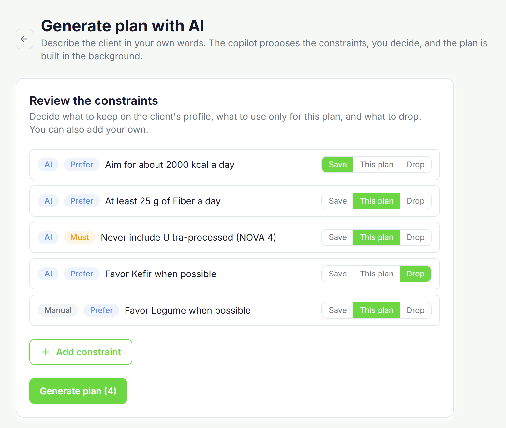

# NutriApp

Plataforma web para nutricionistas con un copiloto de inteligencia artificial que convierte lo que el profesional pide en lenguaje corriente en restricciones formales, y genera con ellas borradores de planes nutricionales. El nutricionista revisa y firma antes de que el cliente vea nada.

Trabajo de Fin de Grado del Doble Grado en Ingeniería Informática y ADE, Facultad de Informática, Universidad Complutense de Madrid. Septiembre de 2026.

**Aplicación en marcha: https://nutriapp-tfg.netlify.app**



## La idea

Los generadores de dietas automáticos tienen un problema de fondo: deciden por el profesional, que es quien responde legalmente de lo que firma. NutriApp se plantea al revés. El nutricionista escribe lo que necesita ("nada de lácteos, unas 2000 kcal al día y mucha verdura"), un modelo de lenguaje lo traduce a restricciones formales, y la aplicación se las enseña para que las confirme, las corrija o añada las suyas. Solo entonces se genera el plan. Es un editor inteligente, no un generador que sustituye a nadie.

La generación combina tres piezas que hacen cosas distintas:

- Un **modelo de lenguaje** (Qwen 2.5 sobre Ollama) que traduce el texto libre a restricciones y comprueba antes de nada si el mensaje tiene sentido, si está completo y si se contradice.
- Un **solver de programación con restricciones** (OR-Tools CP-SAT) que busca el plan semanal. El modelo tiene catorce tipos de restricción clínica, ocho reglas base estructurales y siete de sentido común alimentario, con bandas de tolerancia sobre los objetivos nutricionales.
- Un **validador determinista** que audita el plan antes de que se pueda firmar, y distingue lo que bloquea de lo que solo advierte.

El modelo de lenguaje corre en un worker local, no en la nube, para que los datos clínicos no salgan del sistema.

## Estado

Está todo implementado y desplegado: el panel del nutricionista (clientes, planes, alimentos, calendario, mensajería, ajustes y generación con IA), el panel del cliente (plan firmado, marcas de comidas, peso, citas y mensajes), el motor con su validador y su API, y el worker de generación. La base de datos es Supabase con aislamiento por usuario mediante RLS, verificado con ocho bancos de evidencia.

La API del motor está en https://tfg-nutriapp.onrender.com, con comprobación de estado en `/health`. Es un plan gratuito, así que la primera petición tarda unos veinte segundos en despertar.

En [ACCESO.md](ACCESO.md) están las cuentas de demostración, un recorrido de diez minutos por la aplicación y los avisos sobre el alojamiento.

## La memoria

La memoria completa está en [MEMORIA/TFGTeXiS.pdf](MEMORIA/TFGTeXiS.pdf). Documenta el modelo matemático del solver, las evaluaciones empíricas con sus datos crudos y la prueba con nutricionistas reales.

## Estructura

```
frontend/         Aplicación Next.js 14 con los dos paneles. Ver frontend/README.md
backend/          Motor CP-SAT, validador, traductor, worker y API en Python. Ver backend/README.md
MEMORIA/          Memoria del TFG en LaTeX (plantilla TFGTeXiS, UCM) y el PDF compilado
MOCK-UP V1/       Capturas del prototipo inicial en Figma
MOCK-UP V2/       Capturas del prototipo tras el giro hacia el copiloto
feedback-docs/    Especificación y formalización del motor, experimentos con sus datos y figuras,
                  guía de la prueba con nutricionistas e histórico del diseño de la base de datos
```

## Cómo correr en local

Cada parte tiene su README con los pasos y las variables de entorno: [frontend/README.md](frontend/README.md) y [backend/README.md](backend/README.md). Hace falta Python 3.11 o superior, Node 20, un proyecto de Supabase con las migraciones de `backend/migrations/sql/` aplicadas en orden, y Ollama si se quiere probar la parte de IA.

## Licencia

El código está bajo licencia MIT, en [LICENSE](LICENSE).

La memoria es obra distinta y va bajo Creative Commons BY-NC-ND 4.0, en [MEMORIA/LICENSE](MEMORIA/LICENSE): se puede leer, compartir y citar, pero no modificar ni usar con fines comerciales.

## Autor

Víctor Martínez Blanco, Facultad de Informática, Universidad Complutense de Madrid.

Directores del trabajo: Alejandro Hernández Cerezo y Pablo Gutiérrez Sánchez.
