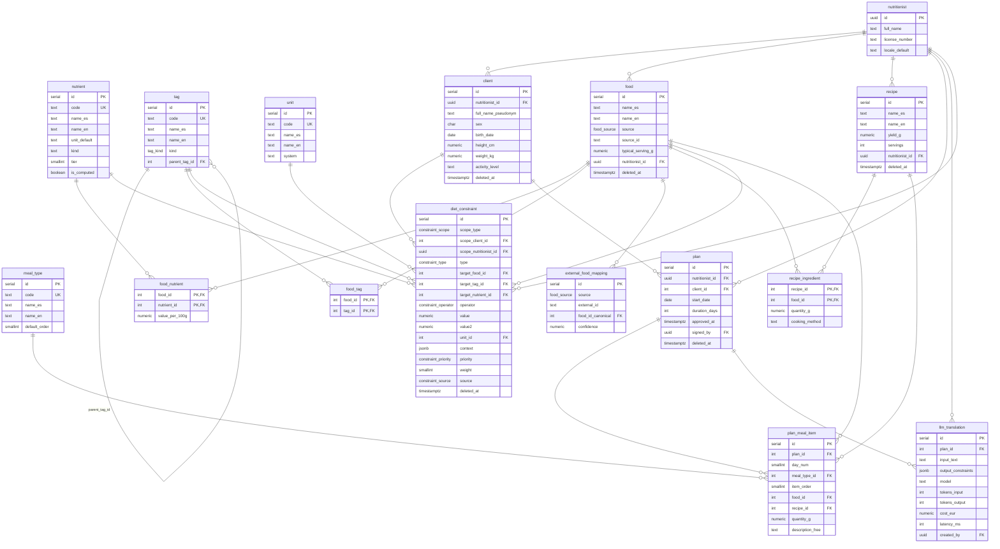

# Modelo de datos (v0)

Diagrama entidad-relación de las 16 tablas de NutriApp. El SQL de
`0001_initial.sql` se corresponde con este esquema.

Bloques:

- **Catálogos**: nutrient, tag, meal_type, unit (se cargan con el seed).
- **Personas**: nutritionist (ligado a Supabase Auth), client.
- **Alimentos**: food, food_nutrient, food_tag, recipe, recipe_ingredient,
  external_food_mapping.
- **Restricciones**: diet_constraint (el núcleo).
- **Plan**: plan, plan_meal_item.
- **Traza IA**: llm_translation.

## Notas

- `nutritionist.id` es el mismo UUID que el usuario de Supabase Auth.
- `food.nutritionist_id` nulo = alimento del catálogo global; con valor = custom.
- `diet_constraint` tiene dos columnas de dueño (`scope_client_id` int y
  `scope_nutritionist_id` uuid) porque el dueño puede ser un cliente o un nutri,
  y un cliente usa id entero mientras que el nutri usa uuid. Un CHECK obliga a
  rellenar solo la que corresponde al `scope_type`.
- `plan_meal_item`: cada línea es un food, una recipe o texto libre (uno solo).
- Soft-delete (`deleted_at`) en food, recipe, plan, diet_constraint y client.
- La tabla se llama `diet_constraint` y no `constraint` porque esta última es
  palabra reservada en SQL.
