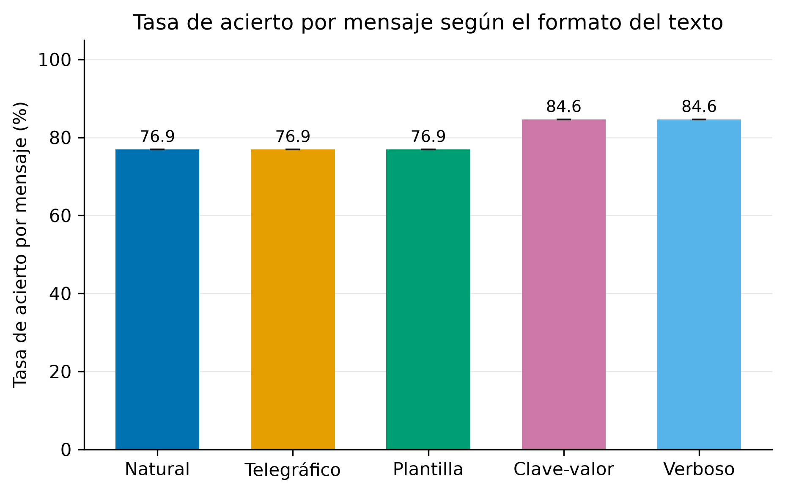
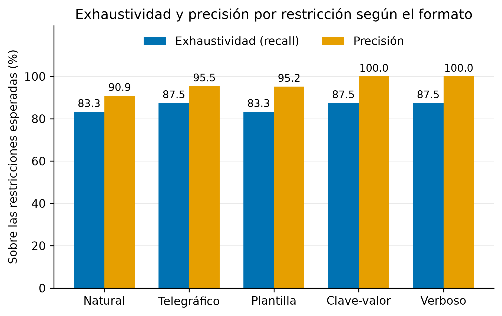
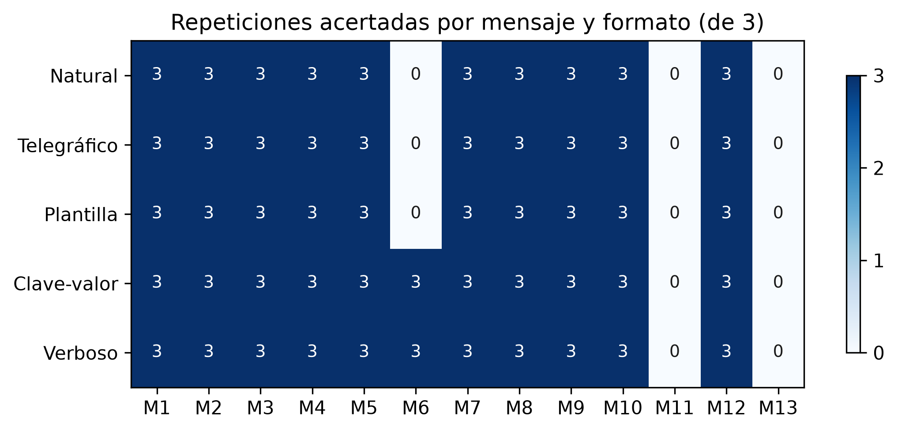
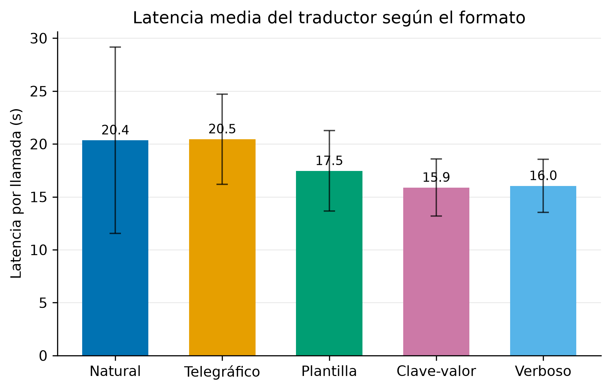
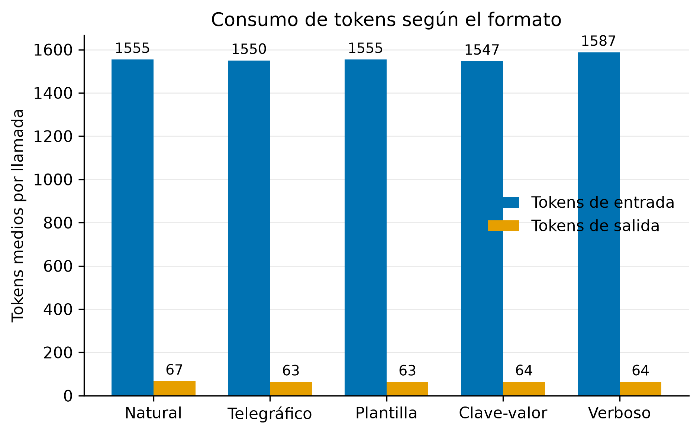
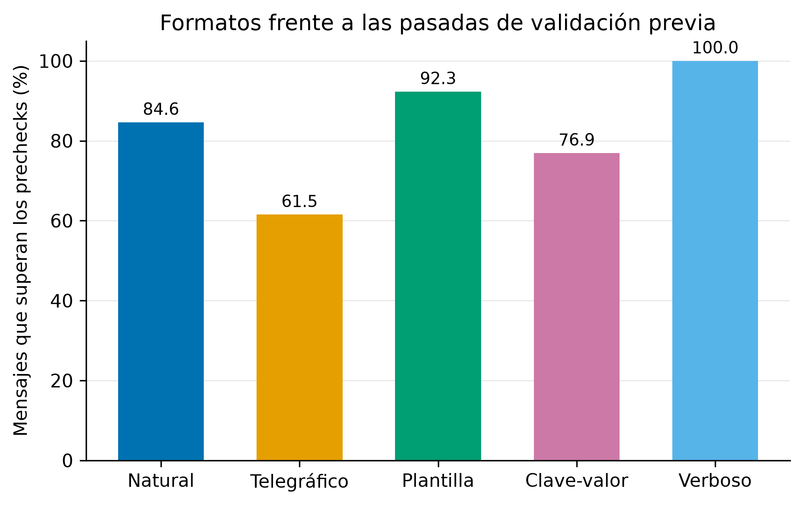

# Estudio empírico: formato del mensaje y calidad de la traducción a restricciones

## 1. Pregunta

El traductor del sistema convierte el texto libre que escribe el nutricionista en filas estructuradas de restricciones dietéticas. La pregunta de este estudio es si la forma de redactar ese texto (la misma información expresada de maneras distintas) afecta a la calidad de la traducción, y si la diferencia justifica añadir un módulo previo que reescriba el mensaje al formato óptimo antes de traducir.

La decisión sobre ese módulo se tomó condicionada al resultado: solo se construye si el estudio muestra una diferencia clara a favor de algún formato. Un resultado negativo (el formato no importa) es igual de válido y se documenta con las mismas gráficas.

## 2. Metodología

### 2.1 Criterio de decisión pre-registrado

Para que el resultado no pudiera ajustarse a posteriori, el criterio de decisión se fijó por escrito y se confirmó antes de lanzar la primera medición:

> Se implementa el módulo reescritor si y solo si el mejor formato alternativo supera al formato natural (el texto libre que escribe un nutricionista real, que actúa como línea base) en al menos 10 puntos porcentuales de tasa de acierto por mensaje, y además iguala o supera al natural en al menos 9 de los 13 mensajes del estudio.

La primera condición exige una mejora de tamaño relevante; la segunda exige que sea consistente y no el efecto de un par de mensajes atípicos.

### 2.2 Formatos evaluados

Cinco formatos, del más humano al más artificial. Cada mensaje del estudio expresa exactamente los mismos requisitos en los cinco:

| Formato | Descripción | Ejemplo (mensaje 2) |
|---|---|---|
| Natural | Texto libre de un nutricionista, línea base | "Busca ganar músculo, es alérgico al cacahuete y quiero al menos 140 g de proteína al día." |
| Telegráfico | Lista de viñetas | "- alergia: cacahuete / - proteína: mínimo 140 g/día / - objetivo: ganar músculo" |
| Plantilla | Campos con etiqueta legible | "Objetivo: ganar músculo. Evitar: cacahuete (alergia). Mínimos: 140 g de proteína al día." |
| Clave-valor | Pares casi de configuración | "alergia=cacahuete; proteina_min=140g/dia; objetivo=ganar_musculo" |
| Verboso | Conversacional con contexto irrelevante de consulta | "Este chico entrena fuerza cuatro días a la semana y me pregunta mucho por los batidos... quiero que llegue al menos a 140 g de proteína al día, y mucho cuidado porque es alérgico al cacahuete." |

### 2.3 Mensajes y verdad de referencia

Trece mensajes con su lista de restricciones esperadas, verificada contra el catálogo real de la base de datos. Cubren 10 de los 14 tipos traducibles: objetivo calórico, mínimo y máximo de nutriente, prohibición y preferencia de etiqueta, prohibición y preferencia de alimento por nombre, reparto calórico entre comidas, proporción entre nutrientes y no repetición de una etiqueta en días consecutivos. En total 24 restricciones esperadas, entre 1 y 3 por mensaje. Los mensajes, sus cinco redacciones y la verdad de referencia completa están en `mensajes.json`, junto a este documento.

Se excluyó a propósito el tipo de límite de raciones con alimento por nombre: es una limitación ya conocida del modelo local documentada en fases anteriores del proyecto, y medirla aquí mediría el modelo, no el formato.

### 2.4 Métrica

El acierto se mide por propiedades con tolerancia, no por igualdad exacta:

- Una restricción esperada cuenta como acertada si el traductor produce una restricción válida con su mismo tipo, su mismo objetivo (etiqueta, nutriente o alimento resueltos contra el catálogo) y, cuando la referencia declara un valor numérico, un valor dentro del 10 por ciento. Para la proporción entre nutrientes se acepta el valor en escala 0-1 o 0-100, porque ambas expresan la misma afirmación.
- El emparejamiento esperada-producida es uno a uno. Las restricciones válidas producidas que no corresponden a ninguna esperada cuentan como espurias, y las que el sistema rechaza en la resolución o la validación se contabilizan aparte.
- Un mensaje se considera acertado en una repetición cuando todas sus esperadas están presentes y no hay ninguna espuria.
- La prioridad (dura o blanda) se registra pero no puntúa: es criterio clínico del modelo, no fidelidad al texto.

Como métricas secundarias se registran la latencia por llamada y los tokens de entrada y salida, que permiten proyectar el coste que tendría el mismo tráfico sobre una API remota de pago por token.

### 2.5 Ejecución

5 formatos x 13 mensajes x 3 repeticiones = 195 llamadas reales al traductor, con el mismo motor y configuración que en producción (modelo local de 7B parámetros con salida estructurada y temperatura 0). Las repeticiones absorben el no determinismo residual del modelo. El experimento no escribe trazas en la base de datos: los resultados crudos van a fichero (`resultados_crudos.json`) y de ahí salen todas las cifras y figuras de este documento, regenerables por script. El harness se autoprobó antes de la pasada real con un cliente simulado que devuelve respuestas perfectas (195 de 195 celdas correctas, más pruebas negativas del emparejador).

Como medida secundaria, cada una de las 65 combinaciones formato-mensaje se pasó una vez por las pasadas de validación previa del sistema (idioma, ámbito, completitud y contradicción), para comprobar si algún formato no humano sería bloqueado antes de llegar al traductor.

## 3. Resultados

### 3.1 Tasa de acierto por mensaje

La figura 1 muestra la tasa de acierto por mensaje de cada formato (media de las tres repeticiones, con su desviación).

| Formato | Acierto por mensaje | Exhaustividad por restricción | Precisión | Espurias | Rechazadas |
|---|---|---|---|---|---|
| Natural | 76,9 % | 83,3 % | 90,9 % | 6 | 9 |
| Telegráfico | 76,9 % | 87,5 % | 95,5 % | 3 | 6 |
| Plantilla | 76,9 % | 83,3 % | 95,2 % | 3 | 9 |
| Clave-valor | 84,6 % | 87,5 % | 100 % | 0 | 9 |
| Verboso | 84,6 % | 87,5 % | 100 % | 0 | 9 |

Dos observaciones previas al análisis. Primera: la desviación entre repeticiones fue cero en todos los formatos; con temperatura 0 y salida estructurada, el modelo respondió de forma idéntica en las tres pasadas de cada celda, así que el acierto por mensaje es todo o nada. Segunda: el resultado es notablemente plano. El mejor formato alternativo (clave-valor, empatado con verboso) supera a la línea base en 7,7 puntos, y la exhaustividad por restricción se mueve en una banda de 4 puntos.

### 3.2 Dónde están los fallos

La figura 5 desglosa el acierto por mensaje y formato, y es la clave del estudio: 10 de los 13 mensajes se traducen perfectamente en los cinco formatos, y los fallos se concentran en tres mensajes concretos.

Para caracterizar cada fallo se sondeó manualmente la salida del traductor:

- **Mensaje 6 (reparto calórico: desayuno 30 %, comida 40 %).** En formato natural el modelo captura ambas comidas pero las emite como dos restricciones de reparto separadas (una con el desayuno, otra con la comida) en lugar de una sola con el reparto conjunto. Para el motor de generación ambas representaciones son equivalentes; la métrica pre-registrada, que exige el reparto conjunto en una fila, lo puntúa como fallo. En telegráfico y plantilla el fallo es real: el modelo pierde una de las dos comidas. En clave-valor y verboso produce la fila única esperada.
- **Mensaje 11 (evitar pescado, preferir legumbres).** El modelo confunde categoría con alimento en los cinco formatos: emite prohibición y preferencia de alimento por nombre ("pescado", "legumbres") en lugar de usar las etiquetas de categoría del catálogo. La capa determinista no encuentra alimentos con esos nombres y rechaza ambas, que es el comportamiento defensivo diseñado (rechazar antes que inventar).
- **Mensaje 13 (no repetir carne roja en días consecutivos).** El modelo entiende la intención y elige el tipo correcto, pero se inventa el código de etiqueta `meat_red` (una inversión del código real `red_meat`) en los cinco formatos, y la resolución contra el catálogo cerrado lo rechaza.

La lectura importa: los mensajes 11 y 13 fallan por igual en los cinco formatos, así que son limitaciones del modelo frente a tipos concretos del catálogo, no efectos del formato. Y el único mensaje donde los formatos difieren (el 6) difiere en parte por un artefacto de representación: si se acepta la representación equivalente de dos filas, el formato natural alcanza el mismo 84,6 por ciento que clave-valor y verboso, y la diferencia entre el mejor formato y la línea base baja de 7,7 a 0 puntos. Esta relectura es posterior al pre-registro y por eso no interviene en la decisión, pero apunta en la misma dirección.

### 3.3 Latencia y coste

| Formato | Latencia media | Tokens entrada | Tokens salida |
|---|---|---|---|
| Natural | 20,4 s (d.t. 8,8) | 1555 | 67 |
| Telegráfico | 20,5 s (d.t. 4,3) | 1550 | 63 |
| Plantilla | 17,5 s (d.t. 3,8) | 1555 | 63 |
| Clave-valor | 15,9 s (d.t. 2,7) | 1547 | 64 |
| Verboso | 16,0 s (d.t. 2,5) | 1588 | 64 |

Los tokens de entrada apenas varían (unas 1550 unidades) porque el prompt de sistema, con el catálogo cerrado y los ejemplos, domina por completo el tamaño de la llamada: incluso el formato verboso, con frases mucho más largas, solo añade unos 40 tokens. La consecuencia para el coste es directa: sobre una API remota de pago por token, el coste por traducción sería esencialmente el mismo con cualquier formato (del orden de 1550 tokens de entrada y 65 de salida por llamada), así que el formato tampoco es una palanca económica. Las diferencias de latencia (de 16 a 20 segundos por llamada en el equipo local) son pequeñas frente a su dispersión y no cambian ninguna decisión en un flujo que ya es asíncrono.

### 3.4 Medida secundaria: los formatos frente a las pasadas de validación previa

Antes del traductor, el sistema pasa cada mensaje por una puerta determinista de idioma y tres comprobaciones con modelos pequeños (ámbito, completitud y contradicción). Los 65 pares formato-mensaje se pasaron una vez por ese filtro.

| Formato | Superan los prechecks | Motivos de bloqueo |
|---|---|---|
| Natural | 11 de 13 | fuera de ámbito (mensajes 11 y 13) |
| Telegráfico | 8 de 13 | fuera de ámbito (mensajes 5, 7, 10, 11 y 13) |
| Plantilla | 12 de 13 | fuera de ámbito (mensaje 11) |
| Clave-valor | 10 de 13 | fuera de ámbito (7 y 13) e idioma no soportado (12) |
| Verboso | 13 de 13 | ninguno |

Dos lecturas. La primera confirma la sospecha que motivaba la medida: las pasadas de validación, entrenadas sobre texto humano, penalizan los formatos artificiales. El telegráfico pierde 5 de 13 mensajes antes de llegar al traductor, y en clave-valor el detector de idioma llega a clasificar un mensaje como lengua desconocida (una cadena de pares clave-valor sin apenas palabras completas). Si el estudio hubiera justificado el reescritor, esta medida confirma que su sitio era detrás de las pasadas (que deben juzgar el texto humano original) y nunca delante; y descarta también la alternativa de pedir al nutricionista que escriba directamente en un formato artificial.

La segunda es un hallazgo colateral sobre el propio filtro: la comprobación de ámbito bloquea dos mensajes naturales perfectamente legítimos (evitar el pescado y preferir legumbres; no repetir carne roja en días consecutivos), frases cortas e imperativas sin cifras que el modelo pequeño no reconoce como petición dietética. Es un falso positivo con impacto real de usuario, queda anotado como ajuste futuro de esa pasada.

## 4. Decisión

El criterio pre-registrado exigía al menos 10 puntos de mejora y consistencia en 9 de 13 mensajes. El mejor formato alternativo mejora 7,7 puntos (consistente, pero por debajo del umbral), y la relectura semántica del mensaje 6 reduce esa diferencia real a cero.

**No se implementa el módulo reescritor.** La conclusión empírica es que el traductor es robusto al formato del mensaje: con un catálogo cerrado en el prompt, salida estructurada y una capa determinista de resolución y validación detrás, da igual que el nutricionista escriba prosa, viñetas o pares clave-valor, e incluso el texto con ruido conversacional traduce igual de bien. Los fallos residuales no son de formato sino del modelo frente a dos situaciones concretas (categoría confundida con alimento y un código de etiqueta invertido), y la vía de mejora natural es el propio catálogo del prompt o un modelo mayor, no un reescritor delante.

Un reescritor habría añadido una llamada más al modelo por petición (más latencia y otra fuente de error) para perseguir una mejora que los datos no respaldan. El hallazgo negativo evita ese coste con evidencia, que era exactamente el propósito del estudio.

## 5. Límites del estudio

- El estudio mide un único modelo (el de producción local); con otro motor el ranking de formatos podría cambiar, aunque la arquitectura del traductor (catálogo cerrado más validación determinista) es la misma para cualquiera.
- Trece mensajes cubren los tipos principales pero no agotan la casuística real; los mensajes fueron redactados para este estudio, no recogidos de nutricionistas en producción.
- La métrica pre-registrada penaliza representaciones semánticamente equivalentes (el caso del mensaje 6); se documenta y se cuantifica su efecto, pero la decisión se tomó con la métrica registrada.
- El harness registra los conteos de cada celda, no las restricciones producidas; la caracterización fina de los fallos se hizo con sondas manuales posteriores sobre los mensajes fallidos.

## 6. Reproducibilidad

Todo el estudio se regenera desde el repositorio: `mensajes.json` (mensajes, formatos y verdad de referencia), `scripts/eval_formats.py` (harness de evaluación, con reanudación por celda y modo de autoprueba), `scripts/plot_formats.py` (todas las figuras, PNG y PDF, desde los resultados crudos) y los ficheros `resultados_crudos.json` y `resultados_prechecks.json` con las mediciones de esta pasada.
