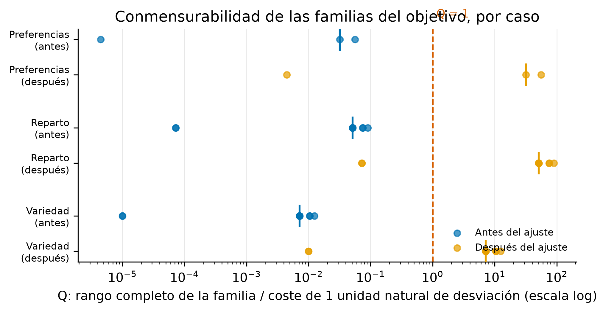
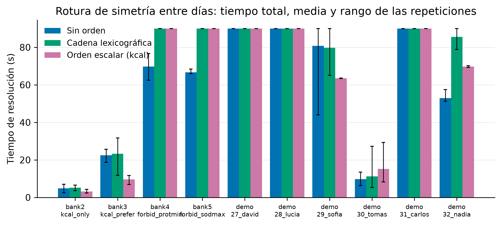
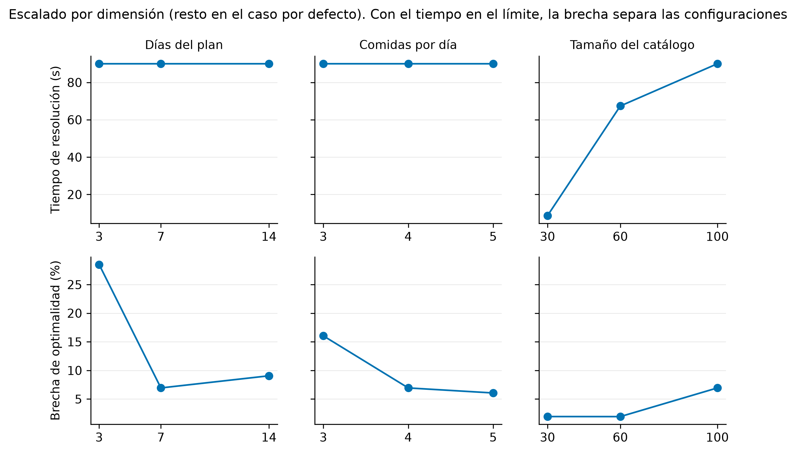
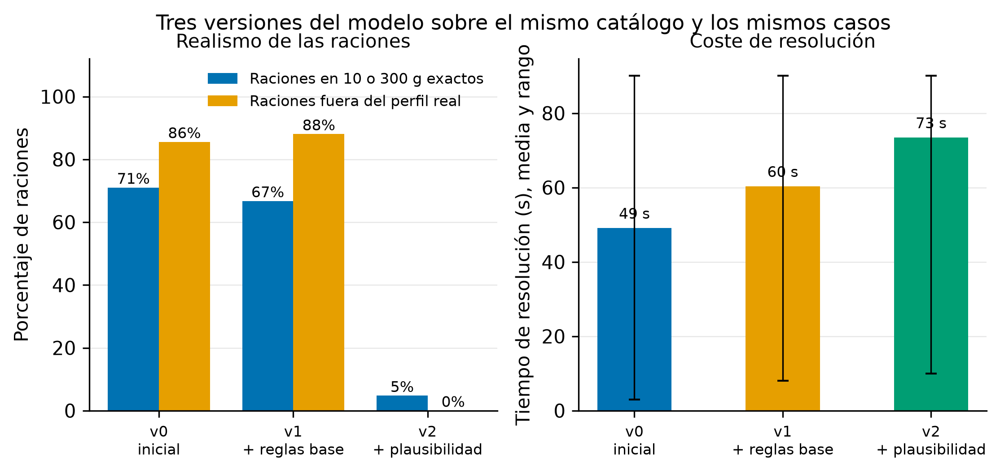

# Experimentos del motor de generación: objetivo, simetría, cotas, tamaño, escalado y versiones

Este documento recoge los experimentos sobre el motor de generación de planes que responden a los comentarios técnicos de los tutores sobre los capítulos escritos de la memoria: las magnitudes de los términos de la función objetivo (¿son conmensurables?), la rotura de simetría entre días, la tabla del tamaño del problema, los experimentos de escalado y la comparativa entre versiones del modelo. Sigue el método del resto de evaluaciones empíricas del proyecto: los criterios de decisión se registran por escrito antes de medir, los resultados crudos se versionan junto al documento y todas las tablas y figuras se regeneran por script.

## 1. Línea base

Antes de tocar nada se capturó la foto completa de los bancos de verificación en local (misma máquina de desarrollo de todo el proyecto, 8 hilos de búsqueda):

| Banco | Resultado |
|---|---|
| Solver (3 repeticiones) | 30/30 en las tres |
| Validador | 38/38 |
| Cola asíncrona | 14/14 |
| Prechecks | 44/44 |
| Traductor | 15/15 |

Tiempos del banco del solver por caso, en las tres repeticiones (ms):

| Caso | Rep 1 | Rep 2 | Rep 3 | Status |
|---|---|---|---|---|
| 1. Maria 3x3 sin configurables | 386 | 255 | 400 | optimal |
| 2. Maria 7x5 kcal soft | 9.266 | 3.977 | 5.522 | optimal |
| 3. Maria 7x5 kcal + prefer | 24.771 | 22.106 | 28.284 | optimal |
| 4. John 7x5 forbid + prot min | 80.684 | 61.121 | 86.287 | optimal |
| 5. Emma 7x5 forbid + sodio max | 90.008 | 39.484 | 36.570 | feasible / optimal / optimal |
| 8. Maria 7x4 diseño (4 tipos) | 90.008 | 90.008 | 90.005 | feasible |

Dos lecturas para el resto del documento. Primera: los casos pesados (4, 5 y 8) viven cerca del límite de 90 s, y el caso 5 cambia de status entre pasadas; como ya se estableció en la formalización, con casos al límite de tiempo la reproducibilidad se define sobre veredictos y garantías, no sobre soluciones concretas. Segunda: la dispersión entre repeticiones de un mismo caso llega a 2x (caso 2), así que ningún veredicto de rendimiento de este documento se apoya en una pasada única.

## 2. Magnitudes de la función objetivo

### 2.1 El problema

La función objetivo suma términos de naturaleza distinta. Las desviaciones nutricionales (objetivo calórico, macros, mínimos y máximos de nutriente) se miden en unidades escaladas del modelo: 1 kcal de desviación son 1.000 unidades, que multiplicadas por el peso de familia (10) y el peso de fila (1 a 10) aportan hasta 100.000 unidades de objetivo por kcal y día. Los términos estructurales y de preferencia se mueven en unidades de 1 por alimento o aparición: el término de variedad completo, con un catálogo de 100 alimentos y peso 5, tiene un rango total de 500. La sospecha planteada por los tutores es que todo lo que no es nutricional queda reducido a ruido numérico.

### 2.2 Criterio pre-registrado

Confirmado antes de lanzar la medición:

> Hay desequilibrio flagrante si, en la mediana de los casos con algún objetivo nutricional, el rango completo alcanzable de una familia no nutricional del objetivo (variedad, reparto, preferencias, no repetición blanda) es menor que la contribución de una unidad natural de desviación (1 kcal, 1 g o 1 mg) del término nutricional dominante del caso. Es decir, si mover esa familia entera de su mejor a su peor valor no compensa ni una unidad de desviación, la familia es numéricamente irrelevante (Q < 1, con Q el cociente entre ambas cantidades).

Remedio pre-registrado si el desequilibrio es flagrante: multiplicar por 1.000 los pesos de las familias no nutricionales (preferencias, no repetición, variedad y reparto), que equivale exactamente a medir las desviaciones nutricionales en unidades naturales enteras en lugar de milésimas, sin tocar ninguna restricción ni la escala del modelo. El ajuste solo se mantiene si tras aplicarlo los bancos siguen verdes y la desviación calórica media del banco sigue por debajo del 5 por ciento; si degrada la calidad nutricional, se retira y el desequilibrio queda documentado como limitación con la tabla de este capítulo como evidencia.

### 2.3 Método

Para cada caso se resuelve el plan con el motor real y se recomputa cada término del objetivo desde la solución devuelta: valor crudo en unidades del modelo, peso efectivo (familia por fila) y contribución ponderada, más una cota superior analítica del rango del término. La recomputación se verifica exacta contra el valor de objetivo que reporta el solver en cada caso, lo que garantiza que la tabla refleja la función objetivo real y no una reconstrucción aproximada.

Casos: los cinco casos del banco con términos blandos (2, 3, 4, 5 y 8) más los seis clientes de demostración con sus restricciones reales, a 7 días y 4 comidas (la configuración por defecto de la aplicación). Script: `backend/scripts/exp_magnitudes.py`; crudos: `magnitudes_crudos.json`.

### 2.4 Resultados

Once casos medidos: los cinco del banco y los seis clientes demo. La recomputación coincidió exactamente con el objetivo reportado por el solver en 10 de los 11; en el restante (demo de Tomás) el valor reportado quedó 1.568 unidades por encima del recomputado, sobre un objetivo de 63.208 millones. La diferencia es holgura de la descomposición del valor absoluto: las variables de exceso y defecto solo quedan apretadas si la minimización las empuja, y en un caso parado dentro del gap del 2 por ciento puede sobrar holgura (la diferencia es par, como corresponde a ese mecanismo). La recomputación da el valor verdadero de la solución devuelta, así que la tabla es fiable en los 11 casos.

Contribución ponderada realizada de cada familia (unidades del objetivo, caso a caso):

| Caso | kcal | macro | nut min | nut max | reparto comida | prefer | variety | spread | objetivo total |
|---|---|---|---|---|---|---|---|---|---|
| banco 2 (kcal solo) | 0 | - | - | - | - | - | 0 | 0 | 0 |
| banco 3 (kcal + prefer) | 0 | - | - | - | - | 2.224 | 100 | 0 | -2.124 |
| banco 4 (prot min) | - | - | 0 | - | - | - | 35 | 4 | 39 |
| banco 5 (sodio max) | - | - | - | 0 | - | - | 60 | 0 | 60 |
| banco 8 (diseño) | - | - | - | - | 33.036.100.000 | 96 | 195 | 4 | 33.036.100.103 |
| demo David | 119.000 | - | - | - | - | - | 215 | 4 | 119.219 |
| demo Lucía | - | - | 0 | - | - | 2.688 | 230 | 0 | -2.458 |
| demo Sofía | - | - | 0 | - | - | - | 45 | 0 | 45 |
| demo Tomás | 694.932.000 | 4.899.720 | - | - | 62.508.450.000 | - | 135 | 0 | 63.208.283.423 |
| demo Carlos | 51.100 | - | - | - | - | - | 220 | 0 | 51.320 |
| demo Nadia | - | - | - | - | - | 2.688 | 60 | 0 | -2.628 |

La sospecha de los tutores queda confirmada con números y con margen. En el caso de Tomás, el término de reparto por comidas aporta 62.508 millones de unidades y la variedad 135: once órdenes de magnitud entre términos que conviven en la misma suma. El cociente Q del criterio pre-registrado (rango completo alcanzable de la familia dividido por el coste de una unidad natural de desviación del término dominante):

| Caso | prefer | spread | variety |
|---|---|---|---|
| banco 2 | - | 0,0514 | 0,0071 |
| banco 3 | 0,0320 | 0,0514 | 0,0071 |
| banco 4 | - | 0,0750 | 0,0104 |
| banco 5 | - | 0,0514 | 0,0071 |
| banco 8 | 0,0000 | 0,0001 | 0,0000 |
| demo David | - | 0,0514 | 0,0071 |
| demo Lucía | 0,0560 | 0,0750 | 0,0104 |
| demo Sofía | - | 0,0900 | 0,0125 |
| demo Tomás | - | 0,0001 | 0,0000 |
| demo Carlos | - | 0,0514 | 0,0071 |
| mediana | 0,0320 | 0,0514 | 0,0071 |

En la mediana, mover la familia de preferencias entera de su mejor a su peor valor compensa 0,032 kcal de desviación; la de variedad, 0,007 kcal. En los casos con reparto por comidas activo (que arrastra un factor de escala adicional de 1.000), las tres familias caen a la diezmilésima.

Una observación matiza el diagnóstico sin cambiarlo: cuando el solver consigue desviación nutricional exactamente cero (bancos 2 y 3), lo que queda de objetivo son solo los términos pequeños, y entonces sí deciden entre soluciones nutricionalmente perfectas. El desequilibrio actúa en los casos con conflicto real, donde ceder una fracción de kcal es matemáticamente preferible a cualquier mejora estructural: en la práctica el objetivo se comportaba como una jerarquía lexicográfica de facto (la nutrición manda y la estructura solo desempata), sin que esa jerarquía estuviera decidida ni documentada.

### 2.5 Veredicto

Desequilibrio flagrante según el criterio pre-registrado (Q mediano muy por debajo de 1 en las tres familias no nutricionales). Se aplica el remedio pre-registrado: los pesos de las familias no nutricionales se multiplican por 1.000 (prefer 4 a 4.000, no repetición 5 a 5.000, variedad 5 a 5.000, reparto del plan 4 a 4.000), que equivale exactamente a medir las desviaciones nutricionales en unidades naturales enteras (1 kcal, 1 g) en lugar de milésimas. Las proporciones dentro de cada grupo no cambian y no se toca ninguna restricción ni la escala del modelo. Tras el cambio, una kcal de desviación sigue costando el doble que dejar un alimento entero sin usar (10.000 frente a 5.000 con pesos de fila iguales): la nutrición sigue mandando, pero la estructura deja de ser invisible.

Re-verificación tras el cambio, sobre los mismos 11 casos y los bancos completos:

- Bancos verdes: solver 30/30 y validador 38/38, con desviación calórica del 0,0 por ciento en los dos casos del banco con objetivo calórico.
- La desviación calórica por caso es idéntica antes y después (0,0 y 0,01 donde había objetivo; el 41 por ciento del caso de Tomás es un conflicto del propio caso, con el mismo valor en ambas pasadas, no un efecto del ajuste).
- La variedad realizada mejora o empata en 8 de los 11 casos: el caso 4 del banco pasa de 7 alimentos sin usar a 1 (y de factible a óptimo), el 3 de 20 a 17, el de David de 43 a 40 y el de Lucía de 46 a 43. Los dos retrocesos (Tomás 27 a 33, Carlos 44 a 49) son casos parados en el límite de tiempo, donde el incumbente concreto oscila entre pasadas.
- Q después del ajuste: medianas de 32 (preferencias), 51 (reparto) y 7 (variedad), todas por encima de 1. Ninguna familia queda por debajo del umbral.

Con los criterios pre-registrados cumplidos (bancos verdes, desviación calórica intacta), el ajuste se mantiene.

Queda una limitación residual documentada: el término de reparto por comidas (meal_kcal_ratio) arrastra un factor de escala adicional de 1.000 propio de su formulación (conserva un decimal del porcentaje mediante multiplicación cruzada), así que en los casos donde está activo sigue empequeñeciendo al resto de familias (Q de 0,07 y 0,01 en los dos casos afectados). Igualarlo exigiría renormalizar la formulación del término, no solo sus pesos, que es exactamente la renormalización profunda que este bloque excluyó: queda anotado como limitación y trabajo futuro, con esta tabla como evidencia.

## 3. Rotura de simetría entre días

### 3.1 Diseño registrado antes de implementar

Dos días de un plan son intercambiables cuando ninguna restricción los distingue: permutar sus asignaciones produce otra solución válida con el mismo valor de objetivo, y el solver puede explorar hasta 7! = 5.040 variantes equivalentes de un mismo plan semanal. La propuesta original de los tutores (un score entero con pesos 2^(F(M-m)+(F-f)) que ordene los días) define un orden lexicográfico, pero materializar ese número con F cercano a 100 desborda cualquier entero de 64 bits. La adaptación implementa el mismo orden sin materializar el número: una cadena lexicográfica dura entre días consecutivos, vec(d) >= vec(d+1) en orden lexicográfico, donde vec(d) es el vector de presencias x[f,d,m] en un orden fijo (alimento, comida), codificada con los booleanos de prefijo igual estándar en programación con restricciones.

La condición de corrección es que la cadena solo se añade cuando la permutación de días es una simetría verdadera del problema, es decir, cuando se cumplen a la vez:

- el plan tiene como mucho 7 días (con exactamente 7, la única ventana de variedad semanal cubre el plan entero y es invariante a permutaciones; con más de 7, las ventanas deslizantes distinguen los días),
- no hay ninguna restricción clínica de no repetición con separación mayor que 1 día,
- toda restricción de raciones máximas por periodo tiene ventana de 1 día o mayor o igual que la duración (ambos casos son invariantes; solo la ventana intermedia acopla días concretos).

Si la condición no se cumple, no se añade nada: imponer un orden entre días no intercambiables puede excluir soluciones óptimas. La rotura ordena el patrón de presencias, no los gramos: dos días con las mismas presencias y distintos gramos siguen siendo permutables. Es una rotura parcial y correcta; completarla con los gramos multiplicaría el coste de codificación para cazar simetrías residuales con poco peso en la búsqueda.

Medición registrada: los casos del banco que activan la condición más los clientes demo, antes y después, con 5 repeticiones por caso y configuración; tiempo total de resolución, status, valor del objetivo y desviación calórica media. Si el cambio empeora de forma clara, los datos se presentan antes de decidir mantener o retirar.

### 3.2 Resultados de la cadena lexicográfica

Diez casos aplicables (el caso 8 del banco queda excluido por su no repetición clínica, que hace los días no intercambiables), 5 repeticiones por brazo y caso. Una repetición se descartó y se repitió porque el portátil se suspendió durante la resolución (CP-SAT cuenta el tiempo suspendido y reportó 20.273 s con un límite de 90).

| Caso | Sin rotura | Con rotura lexicográfica |
|---|---|---|
| banco 2 (kcal solo) | optimal, 4,9 s | optimal, 5,2 s |
| banco 3 (kcal + prefer) | optimal, 22,4 s | optimal, 23,3 s |
| banco 4 (prot min) | optimal, 69,7 s | 5/5 en el límite sin probar óptimo; objetivo 5.000 a 14.000 |
| banco 5 (sodio max) | optimal, 66,7 s | 5/5 en el límite sin probar óptimo; objetivo 60.000 a 85.000 |
| demo David | límite, desv. kcal 0,02 % | límite, desv. kcal 0,56 %; objetivo 13 veces peor |
| demo Lucía | límite | límite, objetivo algo peor |
| demo Sofía | límite sin óptimo | 3/5 óptimo a 79,7 s; objetivo 110.000 a 45.000 |
| demo Tomás | optimal, 9,8 s | optimal, 11,2 s |
| demo Carlos | límite | límite, objetivo 495.300 a 338.400 |
| demo Nadia | optimal, 52,9 s | 3/5 sin probar óptimo, 85,6 s |

Balance: seis casos peores (los bancos 4 y 5 y Nadia pierden la prueba de optimalidad que tenían), tres mejores (Sofía con claridad, Carlos en el incumbente) y dos neutros. La explicación es coherente con lo que hace el solver por dentro: CP-SAT ya detecta y explota simetrías en el presolve y reparte estrategias entre sus hilos de búsqueda, así que la cadena manual compite con un mecanismo interno que funciona, y sus 4.800 booleanos auxiliares y 10.000 restricciones extra (en el caso 7x4 con 100 alimentos) encarecen la propagación justo donde más duele, al cerrar la cota inferior.

**Veredicto: la rotura de simetría se retira.** No se cablea en el motor; el código queda en el script del experimento (`exp_symmetry.py`), reproducible, y el hallazgo negativo se documenta con esta tabla. Es la misma lógica que la decisión del reescritor en el estudio de formatos: el criterio se fijó antes de medir, los datos no acompañan y la decisión se toma con ellos.

### 3.3 Variante escalar (orden por energía diaria)

Tras el resultado negativo de la cadena completa se registró y midió una variante mínima con la misma semántica de orden pero coste casi nulo: energía diaria no creciente entre días consecutivos (seis restricciones lineales sobre sumas ya existentes, cero variables auxiliares). Es correcta bajo la misma condición de intercambiabilidad y deja los empates sin romper a propósito.

| Caso | Sin orden | Con orden escalar |
|---|---|---|
| banco 2 | optimal, 4,9 s | optimal, 3,2 s |
| banco 3 | optimal, 22,4 s | optimal, 9,7 s |
| banco 4 | optimal, 69,7 s; objetivo 5.000 | 5/5 en el límite; objetivo 100.000 |
| banco 5 | optimal, 66,7 s; objetivo 60.000 | 5/5 en el límite; objetivo 75.000 |
| demo David | límite; objetivo 430.100 | límite; objetivo 230.100 |
| demo Lucía | límite; objetivo -2.414.000 | límite; objetivo -2.453.000 |
| demo Sofía | 80,8 s, 1/5 óptimo | 63,5 s, 5/5 óptimo; objetivo 110.000 a 45.000 |
| demo Tomás | optimal, 9,8 s | optimal, 15,3 s |
| demo Carlos | límite; objetivo 495.300 | límite; objetivo 387.200 |
| demo Nadia | optimal, 52,9 s | optimal, 69,8 s |

El balance es mejor que el de la cadena (seis casos mejoran, algunos con claridad), pero los daños donde falla son severos (el banco 4 pasa de óptimo demostrado a un objetivo veinte veces peor en el límite) y, sobre todo, no hay un predicado limpio que separe a priori los casos que mejoran de los que empeoran: la hipótesis natural (ayuda cuando hay objetivo calórico que ancle la magnitud ordenada) muere con los datos, porque Sofía y Lucía mejoran sin objetivo calórico y Tomás empeora teniéndolo. Sin mecanismo causal que lo explique, cablear la variante sería apostar a una lotería por caso.

**Veredicto: tampoco se cablea.** La conclusión conjunta de la sección es en sí misma un resultado para la memoria: sobre este modelo, imponer un orden entre días, en cualquiera de las dos codificaciones probadas, no compite con la gestión interna de simetrías del portfolio multihilo de CP-SAT; su efecto real es reordenar la búsqueda, y eso a veces ayuda y a veces daña sin patrón explotable.

El tiempo total no es la única lectura de la figura: en varios casos las tres barras tocan el límite de 90 segundos y la diferencia real está en el status (óptimo demostrado o no) y en la calidad del incumbente, que recogen las tablas.

## 4. Cotas de dominio ajustadas

### 4.1 El cambio y su registro

La búsqueda de mejoras de eficiencia no terminó en la simetría. Revisando el modelo con la mirada puesta en el tamaño efectivo del problema, apareció una holgura heredada: la cota superior declarada para la suma escalada de cada nutriente por comida se calculaba como si el catálogo entero pudiera coincidir en una comida (número de alimentos por la mayor ración del catálogo por la mayor densidad del catálogo, tres pesimismos multiplicados). El propio modelo garantiza por la regla R2 que una comida lleva a lo sumo 4 alimentos distintos, así que la cota correcta y mucho más ajustada es la suma de las 4 mayores aportaciones individuales alcanzables (ración máxima de cada alimento por su propia densidad). El cambio reduce los techos de dominio en un factor de 25 a 200 según el nutriente, y las variables auxiliares del objetivo (excesos y defectos sobre cada objetivo) heredan la reducción.

La propiedad que lo hace seguro, y que lo distingue de la rotura de simetría, es que una cota válida no cambia el conjunto de soluciones ni el óptimo: solo cambia cuánto tarda el solver en podar. El riesgo es únicamente de rendimiento, y se midió con el mismo protocolo (mismos 10 casos, 5 repeticiones, comparación contra la línea sin el cambio).

### 4.2 Resultados y veredicto

| Caso | Cotas holgadas | Cotas top-4 |
|---|---|---|
| banco 2 | optimal, 4,9 s | optimal, 5,3 s |
| banco 3 | optimal, 22,4 s | optimal, 21,6 s |
| banco 4 | optimal, 69,7 s | optimal, 45,4 s |
| banco 5 | optimal, 66,7 s | optimal, 26,4 s |
| demo David | límite, objetivo 430.100 | límite, objetivo 260.400 |
| demo Lucía | límite, objetivo -2.414.000 | límite, objetivo -2.058.000 |
| demo Sofía | 80,8 s, 1/5 óptimos, objetivo 110.000 | 40,2 s, 5/5 óptimos, objetivo 45.000 |
| demo Tomás | optimal, 9,8 s | optimal, 27,2 s |
| demo Carlos | límite, objetivo 495.300 | límite, objetivo 449.500 |
| demo Nadia | optimal, 52,9 s | 80,1 s, 3/5 óptimos, mismo objetivo |

Leído sobre los casos que rozan o agotan el límite de tiempo, que son el problema real de rendimiento del motor, mejoran 5 de 6: los dos casos pesados del banco recortan un 35 y un 60 por ciento manteniendo el óptimo demostrado, Sofía pasa de 1 óptimo de 5 a 5 de 5 en la mitad de tiempo, y David y Carlos devuelven mejor incumbente con el mismo presupuesto. El coste es que tres casos que ya iban sobrados se vuelven más lentos sin dejar de resolverse dentro del límite, y Lucía devuelve un incumbente peor. Como beneficio lateral no medido aquí, dominios más pequeños reducen la memoria del proceso, que es el recurso crítico de la instancia de hosting gratuita.

**Veredicto: el cambio se mantiene.** Mejora sistemática donde el motor sufría, coste acotado donde iba sobrado, mecanismo causal claro y bancos en verde (solver 30/30, validador 38/38) tras el cambio.

## 5. Tamaño del problema

Cifras del modelo que construye el caso real de la aplicación (cliente demo con 4 restricciones clínicas, 4 comidas al día, catálogo completo de 100 alimentos), medidas instrumentando la construcción por etapas y capturando el resumen de presolve de CP-SAT. Script: `exp_problem_size.py`; crudos: `tamano_problema_crudos.json`.

| Configuración | Variables booleanas | Variables enteras | Restricciones | Variables tras presolve |
|---|---|---|---|---|
| 3 días x 4 comidas | 1.702 | 1.627 | 4.257 | 2.037 |
| **7 días x 4 comidas (caso real)** | **3.802** | **3.663** | **9.634** | **4.505** |
| 14 días x 4 comidas | 8.002 | 7.226 | 19.574 | 9.512 |

Desglose de las 9.634 restricciones del caso real por etapa de construcción: 6.356 del modelo base (enlaces presencia-gramos, cuantización por unidades y sumas de nutrientes precalculadas), 1.592 de las reglas estructurales R1-R8, 987 de la plausibilidad R11-R15, 399 de las 4 restricciones clínicas del cliente y 300 del ensamblaje del objetivo (variedad y reparto). Tras el presolve, CP-SAT reduce las 7.465 variables a 4.505 y trabaja con 5.530 restricciones internas, dominadas por las lineales (3.304 de un término, 703 de n términos) y las cadenas booleanas de los enlaces (688 kBoolAnd, 758 kBoolOr).

Dos lecturas. Primera: el tamaño crece lineal con los días (duplicar días duplica variables), así que la dificultad práctica no viene del tamaño bruto sino de la interacción entre el objetivo y el catálogo (sección 6). Segunda: el caso real es un problema de tamaño moderado para CP-SAT (miles de variables, no millones), y aun así los casos con reparto por comidas agotan el presupuesto de 90 segundos: la dureza está en probar optimalidad sobre el término de reparto, no en propagar el modelo.

## 6. Escalado

Se barre una dimensión cada vez alrededor del caso por defecto (7 días, 4 comidas, catálogo completo), con el mismo cliente demo y sus restricciones reales, 3 repeticiones por celda. El submuestreo del catálogo es sistemático por identificador (un alimento de cada k del catálogo ordenado), reproducible y repartido entre grupos de alimentos. Script: `exp_scaling.py`; crudos: `escalado_crudos.json`.

| Celda | Tiempo medio | Status | Brecha de optimalidad media |
|---|---|---|---|
| 3 días | 90 s | factible | 28,5 % |
| 7 días (defecto) | 90 s | factible | 6,9 % |
| 14 días | 90 s | factible | 9,1 % |
| 3 comidas | 90 s | factible | 16,0 % |
| 4 comidas (defecto) | 90 s | factible | 6,9 % |
| 5 comidas | 90 s | factible | 6,1 % |
| catálogo 30 | 8,7 s | óptimo | 1,9 % |
| catálogo 60 | 67,4 s | óptimo | 1,9 % |
| catálogo 100 (defecto) | 90 s | factible | 6,9 % |

Tres lecturas. Primera y principal: **el tamaño del catálogo es la dimensión que gobierna el coste**: con 30 alimentos el caso se prueba óptimo en 8,7 segundos, con 60 en 67,4, y con 100 se agota el presupuesto. Es coherente con la tabla de la sección 5 (las variables crecen con |F| x |D| x |M|, pero el catálogo multiplica además las alternativas por hueco, que es lo que dispara la búsqueda). Segunda: con el catálogo completo, todas las celdas de días y comidas saturan el límite de 90 segundos y la comparación se traslada a la brecha de optimalidad, que es moderada en el entorno del caso por defecto (6-9 por ciento) y solo se dispara en las configuraciones cortas (28,5 por ciento a 3 días, 16 por ciento a 3 comidas). Tercera, y conviene decirla porque sorprende: menos días o menos comidas no facilitan el problema en brecha relativa. El conjunto de restricciones de este cliente incluye un reparto por comidas, cuyo término domina el objetivo (sección 2); con menos días o comidas el valor absoluto del objetivo es menor y la misma holgura absoluta pesa más en términos relativos, así que la brecha relativa entre duraciones es indicativa y no directamente comparable. El dato robusto es el del catálogo, donde el status cambia de categoría (óptimo probado frente a límite agotado).

## 7. Comparativa de versiones del modelo

### 7.1 Método registrado antes de ejecutar

Tres versiones del motor, reconstruidas por commit en worktrees de git:

| Versión | Commit | Modelo |
|---|---|---|
| v0 | e076526 | modelo inicial: estructura, suelos fisiológicos y catálogo de restricciones |
| v1 | dbb9b23 | v0 más las reglas base de sentido común (no repetir en el día, variedad diaria, reparto) |
| v2 | actual | v1 más la capa de plausibilidad del catálogo (perfiles de ración, unidades, franjas, roles) y los dos ajustes de este bloque (pesos conmensurables y cotas top-4) |

Para aislar el efecto de las reglas, las tres versiones se ejecutan con el mismo catálogo actual, los mismos clientes y los mismos casos: el harness carga las entradas una sola vez con el cargador actual, las vuelca a JSON, y un runner mínimo por worktree reconstruye los tipos de su versión y llama a su generate_plan con el mismo límite de tiempo (90 s, por parámetro de la firma, estable desde la v0) y los mismos 8 hilos. Las métricas (tiempo, status, desviación calórica, raciones en los límites del perfil, variedad) las calcula un analizador común fuera de las versiones. El catálogo histórico también cambió entre versiones (de 28 a 100 alimentos), pero eso es una decisión de datos, no de modelo, y aquí no se mide.

Expectativa registrada: v0 más rápida pero implausible (la auditoría de la capa de plausibilidad midió en su día dos de cada tres raciones en los extremos de los límites globales), v2 más lenta pero plausible. La tabla muestra el precio de cada capa de realismo.

### 7.2 Resultados

Las tres versiones, sobre el mismo catálogo de 100 alimentos, los mismos 11 casos y 3 repeticiones por caso (33 resoluciones por versión, límite de 90 segundos y 8 hilos en todas):

| Versión | Status | Tiempo medio | Desv. kcal media | Raciones en 10/300 g exactos | Fuera del perfil real | Distintos por día | Máx. mismo alimento/día |
|---|---|---|---|---|---|---|---|
| v0 inicial | 21 óptimos, 11 factibles, 1 sin respuesta | 49,1 s | 8,28 % | 71,0 % | 85,6 % | 13,5 | 5 |
| v1 + reglas base | 20 óptimos, 13 factibles | 60,4 s | 8,09 % | 66,7 % | 88,1 % | 13,5 | 2 |
| v2 + plausibilidad | 15 óptimos, 18 factibles | 73,5 s | 8,24 % | 4,8 % | 0,0 % | 14,3 | 2 |

La expectativa registrada se cumple y con márgenes claros. La v0 es la más rápida y la que produce planes que ningún profesional firmaría: el 71 por ciento de las raciones cae exactamente en los límites globales de 10 o 300 gramos (los atractores que motivaron la capa de plausibilidad), el 85,6 por ciento queda fuera del perfil de ración real de su alimento, y un mismo alimento llega a aparecer 5 veces en un día. Las reglas base de la v1 eliminan la concentración (máximo 2 apariciones por día) por un 23 por ciento más de tiempo, pero no tocan las raciones. La capa de plausibilidad de la v2 es la que convierte los planes en comida real: raciones fuera de perfil al 0 por ciento y atractores al 4,8 por ciento (el residuo son alimentos cuyo perfil legítimamente incluye 10 o 300 gramos), a cambio de un 50 por ciento más de tiempo que la v0 y de probar el óptimo en menos casos dentro del mismo presupuesto. La calidad nutricional (desviación calórica) es indistinguible entre versiones: lo que compran las capas es realismo alimentario, no macros.

La única resolución sin respuesta del experimento es una repetición del caso de diseño en la v0 (agotó el límite sin encontrar solución ni probar infactibilidad); las otras dos repeticiones del mismo caso sí resolvieron, un recordatorio de que el portfolio multihilo no es determinista al límite de tiempo.

## 8. Conclusiones para la memoria

El material de este documento se organiza en dos ejes, que conviene mantener separados en el capítulo de evaluación y conectar una sola vez a través del límite de tiempo (en los casos que agotan el presupuesto, una búsqueda más eficiente devuelve mejor plan con el mismo límite).

**Eje de calidad del plan (qué elige el solver):**

- Las magnitudes de la función objetivo estaban desequilibradas tal como se sospechaba, y la tabla de la sección 2 lo cuantifica: mover una familia estructural entera compensaba centésimas de kcal. El ajuste de pesos por 1.000 es la intervención medida que se queda: restaura la conmensurabilidad (Q mediano de 7 a 51), mejora la variedad realizada en 8 de 11 casos sin ceder nada de calidad nutricional, y deja como limitación documentada el término de reparto por comidas, que arrastra un factor de escala propio.
- La comparativa de versiones (sección 7) es la evidencia central del valor de las capas del modelo: sobre el mismo catálogo y los mismos casos, el modelo inicial producía un 71 por ciento de raciones en los extremos exactos y hasta 5 repeticiones diarias de un alimento; el actual deja las raciones fuera de perfil en el 0 por ciento a cambio de un 50 por ciento más de tiempo. La desviación calórica es indistinguible entre versiones: las capas compran realismo alimentario, no macros.

**Eje de eficiencia (cuánto tarda en elegirlo):**

- La rotura de simetría entre días, en sus dos codificaciones (la cadena lexicográfica adaptada de la propuesta original y la variante escalar mínima), es un hallazgo negativo medido: no compite con la gestión interna de simetrías del portfolio de CP-SAT y su efecto real es reordenar la búsqueda, a veces a favor y a veces en contra, sin patrón explotable. Se retira con los datos de la sección 3 como evidencia, el mismo tratamiento que recibió el módulo reescritor del estudio de formatos.
- Las cotas de dominio apoyadas en R2 (sección 4) son la mejora de eficiencia que sí se queda: recortes del 35 y el 60 por ciento en los casos pesados del banco manteniendo el óptimo probado, un caso que pasa de 1 de 5 óptimos a 5 de 5, y mejores incumbentes en el límite, con coste acotado en casos que iban sobrados.
- El tamaño del problema (sección 5) y el escalado (sección 6) dan las cifras de contexto: el caso real son miles de variables (7.465, 4.505 tras presolve), el crecimiento con los días es lineal, y la dimensión que gobierna el coste es el catálogo, con el cambio de categoría entre 60 alimentos (óptimo en 67 segundos) y 100 (límite agotado).

**Método.** Todo veredicto de este documento se apoya en criterios registrados antes de medir, repeticiones, y comparaciones sobre veredictos y garantías (no sobre soluciones concretas, que con CP-SAT multihilo al límite de tiempo no son reproducibles). Dos incidentes de instrumentación merecen quedar como lecciones: la suspensión del equipo durante pasadas largas infla el reloj de pared y envenena los tiempos (los harness piden ahora al sistema no suspender y descartan relojes imposibles), y dos campañas de medición concurrentes se contaminan mutuamente por la CPU compartida (la campaña afectada se descartó y se repitió limpia entera).
