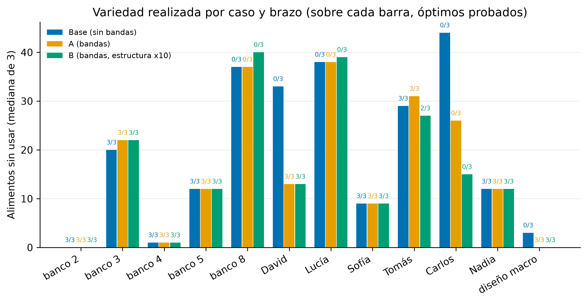
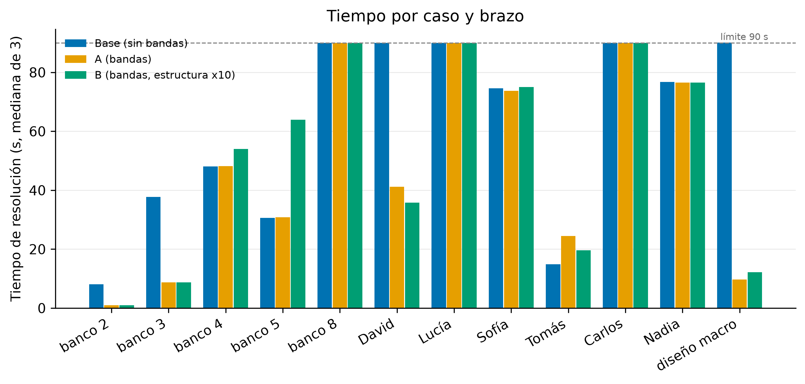
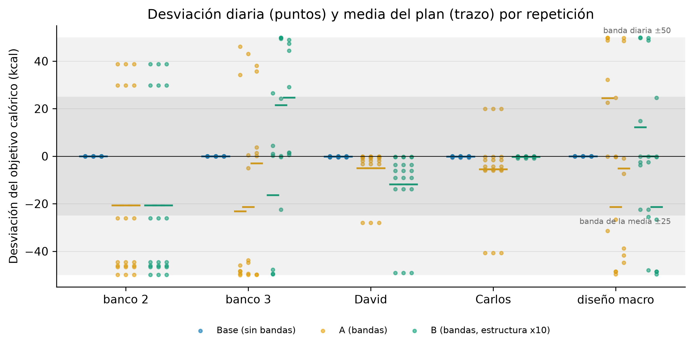

# Experimento sobre la jerarquía de la función objetivo: bandas de tolerancia y ancla del plan

Este documento recoge el segundo experimento sobre la función objetivo del motor de generación. El primero (documento de experimentos del motor, sección 2) corrigió la inconmensurabilidad entre familias: la estructura del plan había quedado reducida a ruido numérico frente a las desviaciones nutricionales, y los pesos se reescalaron para que ambas familias midieran en unidades comparables. Este segundo experimento cuestiona la jerarquía que quedó tras aquel ajuste, con un criterio clínico: una desviación calórica de 10 o 20 kcal en un día no tiene relevancia para el profesional, y un alimento repetido o un plan poco variado sí la tiene. Sigue el mismo método del resto de evaluaciones del proyecto: la formulación, los valores y los criterios de decisión se registran por escrito antes de medir, los resultados crudos se versionan junto al documento y las tablas y figuras se regeneran por script.

## 1. El problema

Tras el reescalado, el coste de una kcal de desviación en un día es el peso de familia (10) por el peso de fila por 1.000 unidades escaladas. Ninguna fila de objetivo calórico de la aplicación lleva peso 1: los clientes de demostración llevan 7 (uno lleva 8) y el traductor asigna 5 por defecto. Con el peso 7, que es el habitual, la jerarquía real es esta:

| Concepto | Coste en unidades del objetivo |
|---|---|
| 1 kcal de desviación, un día, fila 7 | 70.000 |
| 1 alimento del catálogo sin usar en todo el plan | 5.000 |
| 1 aparición por encima del tope de reparto | 4.000 |
| 1 aparición de un alimento preferido, filas 4 a 6 | 16.000 a 24.000 |
| 1 repetición blanda prohibida, fila 5 | 25.000 |

Una kcal de desviación en un solo día equivale a 14 alimentos sin usar, y 20 kcal a 280, casi tres catálogos enteros. Los crudos del experimento anterior enseñan la consecuencia: en los dos clientes de demostración con objetivo calórico que agotan el límite de tiempo, el solver termina con desviación del 0,01 por ciento y 40 y 49 alimentos sin usar de 100. Gasta el presupuesto de búsqueda en clavar la energía al gramo, que no le importa a nadie, en vez de en mejorar la variedad, que sí se ve.

La jerarquía en la que la nutrición manda siempre fue una decisión implícita de la formulación original, que el primer experimento hizo visible pero no cuestionó.

## 2. Deliberación

La sesión de trabajo previa a este pre-registro recorrió las opciones con números delante. Se resumen aquí las decisiones y su motivo.

**Banda muerta frente a reponderación.** Bajar el peso calórico a secas sigue penalizando la primera kcal igual que la número cien, que es justo lo que no tiene sentido clínico. La banda muerta (penalizar solo lo que sobresale de una tolerancia) codifica la afirmación clínica tal cual. Dentro de la banda no cabe un "penaliza muy poco": con pesos enteros el mínimo es 1, que con fila 7 son 7.000 por kcal, más que un alimento sin usar; así que dentro de la banda el coste es cero.

**El riesgo de deriva y el ancla del plan.** Una banda solo diaria deja libre al solver para pegarse cada día al borde que le convenga (previsiblemente el superior, porque más energía son más alimentos y más variedad). Con una banda diaria de 100 kcal, un plan de 1.300 podría quedarse en 1.400 todos los días, y eso ya no es una desviación pequeña. La decisión fue combinar dos bandas: una diaria pequeña, que da margen para comer algo más o algo menos según el día, y una segunda sobre la media del plan, estrecha y casi obligatoria, de forma que unos días compensen a otros y la media quede pegada al objetivo. El ancla se define sobre la media y no sobre la suma para que valga igual en planes de 3, 7 o 14 días.

**Absoluta o porcentual.** Para la energía, banda absoluta en kcal: es el lenguaje del profesional y el objetivo que fija ya es una estimación redondeada. Para los macronutrientes, porcentual: 5 gramos de proteína no significan lo mismo con un objetivo de 60 que con uno de 180.

**Reequilibrio fuera de banda.** Fuera de la banda diaria, la pendiente actual (70.000 por kcal con fila 7) seguiría aplastando a la estructura. La sesión valoró multiplicar la familia estructural por 100 (un día a 100 kcal del objetivo habría valido 7 alimentos sin usar) y se descartó por excesivo: se registra por 10, que deja la energía por delante fuera de banda pero a una distancia de un orden de magnitud, no de dos. El ancla del plan lleva un factor adicional de 10 sobre la pendiente diaria, para que salirse de la media sea casi imposible en la práctica sin llegar a ser una restricción dura (una restricción dura volvería infactibles los casos de conflicto, que hoy devuelven un plan imperfecto con aviso).

**Lo que queda fuera de este experimento.**

- Tolerancia configurable por fila: solo se implementa el valor por defecto global. Exponerla en el contexto de la fila tocaría validación, interfaz y traductor.
- Reparto calórico por comidas (meal_kcal_ratio): es el mismo tema y la formulación está clara (dividir la diferencia cruzada por 1.000 con una división entera para retirar su factor propio, y una banda de p puntos porcentuales de la energía del día, que resulta lineal). Pero solo dos de los once casos lo activan y uno es el caso de conflicto: un caso limpio no sostiene un veredicto. Queda documentado con la formulación como trabajo futuro.
- Variedad por familias de alimentos: durante la sesión surgió que el término de variedad actual (lineal en alimentos sin usar) no expresa lo que importa clínicamente, que es la presencia de cada familia de alimentos en proporción a un peso que se le asigne, y que pasar de 5 a 6 alimentos distintos debería valer mucho más que pasar de 50 a 51. Es un cambio de formulación distinto (convexo por tramos sobre grupos, con datos de catálogo que hoy no existen) y se aplaza. Conviene dejar anotado que el tamaño del catálogo no cambia hoy ninguna decisión: penalizar los alimentos sin usar es penalizar los usados con una constante delante, así que un catálogo mayor infla el número del objetivo sin mover el óptimo.
- Consulta a los tutores antes de medir: se decidió no hacerla; el cambio es barato y reversible y el resultado les llegará con los datos.

## 3. Formulación registrada

Para una fila blanda de objetivo calórico con valor v y peso de fila p, sobre un plan de D días. Las variables de exceso y defecto por día (over_d, under_d) son las de la linealización actual del valor absoluto y no cambian. Sean T_d = 50 kcal la tolerancia diaria y T_m = 25 kcal la tolerancia sobre la media, ambas llevadas a la escala entera del modelo (por 1.000).

Exceso diario fuera de banda:

$$
\text{ex}_d \ge \text{over}_d + \text{under}_d - T_d, \qquad \text{ex}_d \ge 0
$$

Desviación con signo del plan y su exceso fuera de la banda de la media (la banda sobre la media es una banda de D por T_m sobre la suma):

$$
S = \sum_d (\text{over}_d - \text{under}_d), \qquad S = \text{over}_S - \text{under}_S
$$

$$
\text{ex}_S \ge \text{over}_S + \text{under}_S - D \cdot T_m, \qquad \text{ex}_S \ge 0
$$

Término que entra en el objetivo, con K = 10 el factor del ancla:

$$
w_{\text{kcal}} \cdot p \cdot \Big( \sum_d \text{ex}_d + K \cdot \text{ex}_S \Big)
$$

Para macro_target la estructura es idéntica con el peso de familia del macro (w_protein, w_carb o w_fat) y tolerancias porcentuales del objetivo: T_d = 5 por ciento de v y T_m = 2,5 por ciento de v, redondeadas en la escala entera. Las filas duras no cambian (igualdad exacta por día). Los mínimos y máximos de nutriente no cambian: son umbrales de un solo lado y no tienen desviación que tolerar. Una fila blanda cuenta como satisfecha en la métrica de cumplimiento cuando su exceso fuera de bandas es cero.

Como la minimización empuja los excesos hacia abajo, en el óptimo ex_d = max(0, |desviación_d| − T_d) y ex_S = max(0, |S| − D·T_m). Dentro de las bandas, las variables over y under pueden quedar con holgura (ambas positivas) sin afectar al valor del objetivo: la recomputación externa del objetivo trabaja sobre las desviaciones reales de la solución, no sobre esas variables.

Pesos por brazo:

| Peso | Hoy y brazo A | Brazo B |
|---|---|---|
| w_kcal, w_protein, w_carb, w_fat | 10, 8, 6, 6 | 10, 8, 6, 6 |
| w_variety, w_no_repeat | 5.000 | 50.000 |
| w_prefer, w_spread | 4.000 | 40.000 |

Jerarquía resultante en el brazo B, con fila 7 (la habitual):

| Situación | Coste | Equivale a |
|---|---|---|
| 1 kcal fuera de la banda diaria | 70.000 | 1,4 alimentos sin usar |
| Un día a 100 kcal del objetivo (50 fuera de banda) | 3.500.000 | 70 alimentos sin usar |
| Media del plan 1 kcal fuera de su banda (7 de suma) | 4.900.000 | 98 alimentos sin usar |
| Media del plan 5 kcal fuera (objetivo a 30 kcal) | 24.500.000 | casi 5 catálogos |
| 1 aparición de un preferido, fila 5 | 200.000 | 2,9 kcal fuera de banda |

## 4. Pre-registro

Confirmado por escrito antes de lanzar ninguna medición.

### 4.1 Brazos

- **Base**: el motor actual, sin bandas, pesos de hoy. Se mide en la misma sesión que los otros dos brazos, en la misma máquina, para que la comparación no dependa de crudos anteriores.
- **A**: bandas y ancla (T_d 50, T_m 25, K 10; macros 5 y 2,5 por ciento) con los pesos de hoy.
- **B**: lo mismo que A con la familia estructural multiplicada por 10.

### 4.2 Casos y repeticiones

Los once casos del experimento anterior (cinco del banco con términos blandos y los seis clientes de demostración, a 7 días y 4 comidas) más un caso de diseño nuevo, necesario porque ningún caso existente permite medir la banda de macros salvo el de conflicto:

- **diseño macro**: María, 7 días y 5 comidas, objetivo calórico blando de 1.500 kcal (fila 7) y objetivo blando de proteína de 90 g (fila 7). La proteína queda dentro del rango humano de la regla R4 para sus 68 kg.

Tres repeticiones por caso y brazo, límite de 90 segundos y 8 hilos en todas, ejecución secuencial sin ninguna otra campaña concurrente, con el guardado contra la suspensión del equipo y el descarte de repeticiones con reloj imposible heredados del experimento anterior. Los casos se dividen para el análisis en tres grupos:

- **Afectados limpios**: banco 2, banco 3, David, Carlos (objetivo calórico blando, sin conflicto) y diseño macro. Son los casos donde la banda cambia el objetivo y donde se espera el efecto.
- **Control de conflicto**: Tomás (su desviación del 41 por ciento es del propio caso y debe seguir ahí; sirve para comprobar que el ancla no rompe la factibilidad de un caso irresoluble).
- **Control de regresión**: banco 4, banco 5, banco 8, Lucía, Sofía, Nadia. Sin objetivo calórico ni de macros blando: la banda no toca su objetivo. En el brazo B sí cambia su escala (todos sus términos se multiplican por 10), lo que no altera el óptimo pero puede alterar la búsqueda.

### 4.3 Métricas por repetición

Status, tiempo, valor del objetivo reportado y recomputado desde la solución (con verificación de igualdad, como en el experimento anterior), desviación calórica con signo de cada día, desviación con signo de la media, exceso fuera de la banda diaria (suma en kcal) y fuera de la banda de la media (kcal), alimentos distintos usados y sin usar, apariciones por encima del tope de reparto, y en el caso de diseño las desviaciones diarias y media de proteína.

### 4.4 Criterios de decisión

Un brazo con bandas se considera **admisible** si cumple a la vez:

1. **Estructura**: en al menos 3 de los 5 casos afectados limpios, la mediana de alimentos sin usar baja respecto a la base o el caso pasa de límite de tiempo a óptimo probado en al menos 2 de 3 repeticiones. En ninguno de los 5 sube la mediana de alimentos sin usar.
2. **Nutrición fuera de banda**: en los casos afectados limpios que terminan en óptimo, el exceso fuera de bandas (diario y de la media) es exactamente cero. En los que paran por límite de tiempo, la suma del exceso diario fuera de banda es menor del 1 por ciento del objetivo diario por día, y la media queda dentro de su banda.
3. **Factibilidad**: ningún caso, en ninguna repetición, pasa a infactible o a sin respuesta. Tomás sigue devolviendo plan.
4. **Tiempo**: ningún caso que la base prueba óptimo en las 3 repeticiones pierde la prueba en más de 1 de las 3 del brazo.
5. **Bancos**: banco del solver 30 de 30 con el criterio redefinido de la sección 4.5, validador 38 de 38, cola asíncrona, prechecks y traductor en verde, y extremo a extremo local en verde.

Regla de decisión: si A y B son admisibles, se queda **B**, que es la jerarquía decidida en la deliberación (la reponderación es parte de la propuesta, no un añadido). Si solo A es admisible, se queda A y la reponderación se documenta como no sostenida por los datos. Si ninguno es admisible, se revierte el motor y el experimento se documenta con su evidencia como hallazgo negativo y trabajo futuro, igual que la rotura de simetría y el reescritor del estudio de formatos.

Hipótesis registradas, además de los criterios: la desviación con signo de la media se quedará dentro de su banda por construcción y se espera que se acerque al borde superior; los casos que hoy agotan el límite afinando la energía (David, Carlos) resolverán más rápido o probarán el óptimo, porque el objetivo deja de exigir la igualdad exacta al gramo.

### 4.5 Redefinición del criterio de los bancos

Hoy los casos 2 y 3 del banco del solver comprueban que la desviación calórica media es menor del 5 por ciento. Con la banda, el solver deja de optimizar dentro de ella y esa desviación esperada sube hasta la tolerancia (50 sobre 1.500 es un 3,3 por ciento, dentro del umbral antiguo, pero por casualidad de los valores). El criterio nuevo, registrado antes de medir, es el que dice algo sobre el modelo: en los casos 2 y 3, **cada día queda dentro de ±50 kcal del objetivo y la media del plan dentro de ±25 kcal**. El resto de comprobaciones del banco no cambia. El validador no interfiere: solo audita los objetivos marcados como duros, con una tolerancia de cuantización del 1 por ciento, y no mira los blandos.

## 5. Resultados

Campaña de 108 resoluciones (12 casos, 3 brazos, 3 repeticiones), secuencial, en la máquina de desarrollo de siempre con 8 hilos y límite de 90 segundos. Ninguna repetición fue descartada por reloj imposible. Script: `backend/scripts/exp_objective.py` (las tablas se regeneran con `--table` y los criterios de la sección 4.4 se evalúan automáticamente); crudos: `bandas_crudos.json`; figuras: `backend/scripts/plot_objective.py`.

### 5.1 Status, tiempo y estructura

Óptimos probados de 3 repeticiones, mediana del tiempo de resolución y mediana de alimentos del catálogo sin usar:

| Caso | Grupo | Base | A | B |
|---|---|---|---|---|
| banco 2 | afectado | 3/3, 8,1 s, 0 sin usar | 3/3, 0,9 s, 0 | 3/3, 1,0 s, 0 |
| banco 3 | afectado | 3/3, 37,7 s, 20 | 3/3, 8,7 s, 22 | 3/3, 8,7 s, 22 |
| David | afectado | 0/3, 90 s, 33 | 3/3, 41,1 s, 13 | 3/3, 35,8 s, 13 |
| Carlos | afectado | 0/3, 90 s, 44 | 0/3, 90 s, 26 | 0/3, 90 s, 15 |
| diseño macro | afectado | 0/3, 90 s, 3 | 3/3, 9,7 s, 0 | 3/3, 12,2 s, 0 |
| Tomás | conflicto | 3/3, 14,8 s, 29 | 3/3, 24,5 s, 31 | 2/3, 19,6 s, 27 |
| banco 4 | control | 3/3, 48,1 s, 1 | 3/3, 48,2 s, 1 | 3/3, 54,1 s, 1 |
| banco 5 | control | 3/3, 30,7 s, 12 | 3/3, 30,8 s, 12 | 3/3, 64,0 s, 12 |
| banco 8 | control | 0/3, 90 s, 37 | 0/3, 90 s, 37 | 0/3, 90 s, 40 |
| Lucía | control | 0/3, 90 s, 38 | 0/3, 90 s, 38 | 0/3, 90 s, 39 |
| Sofía | control | 3/3, 74,6 s, 9 | 3/3, 73,7 s, 9 | 3/3, 75,0 s, 9 |
| Nadia | control | 3/3, 76,8 s, 12 | 3/3, 76,6 s, 12 | 3/3, 76,6 s, 12 |

Tres lecturas. Primera: en los casos afectados el efecto es el previsto y grande. David pasa de agotar los 90 segundos con 33 alimentos sin usar a probar el óptimo en 41 segundos con 13; el caso de diseño, de 90 segundos sin óptimo a 10 segundos con los 100 alimentos usados; el banco 2 de 8 segundos a 1 y el banco 3 de 38 a 9. La hipótesis registrada sobre los tiempos se cumple: al dejar de exigir la energía al gramo, los casos que gastaban el presupuesto en afinarla resuelven en una fracción del tiempo o prueban el óptimo. Segunda: el banco 3 sube de 20 a 22 alimentos sin usar en los dos brazos; se analiza en la sección 6, porque es lo único que falla el pre-registro. Tercera: los seis casos de control quedan idénticos en el brazo A, que solo cambia el objetivo donde hay un objetivo blando de energía o macros; en el brazo B cambian algo por el reescalado (el banco 5 tarda el doble sin dejar de probar el óptimo, Lucía y el banco 8 devuelven 1 y 3 alimentos menos en el límite de tiempo, y Tomás pierde un óptimo probado de tres). Como en los casos limpios ningún día sale de las bandas, A y B tienen en ellos el mismo óptimo salvo escala; la diferencia entre ambos en Carlos (26 frente a 15) es un efecto del reescalado sobre la búsqueda, no de la jerarquía.

### 5.2 Desviaciones del objetivo

Para cada caso afectado, media con signo del plan, peor día y exceso fuera de bandas, en las tres repeticiones:

| Caso | Brazo | Media con signo (kcal) | Peor día (kcal) | Fuera de banda diaria / de la media |
|---|---|---|---|---|
| banco 2 | base | 0,0 / 0,0 / 0,0 | 0,0 | 0 / 0 |
| banco 2 | A y B | −20,7 en las tres | 49,9 | 0 / 0 |
| banco 3 | base | 0,0 / 0,0 / 0,0 | 0,0 | 0 / 0 |
| banco 3 | A | −23,1 / −21,4 / −3,0 | 50,0 | 0 / 0 |
| banco 3 | B | −16,4 / +21,5 / +24,7 | 49,9 | 0 / 0 |
| David | base | −0,2 en las tres | 0,5 | 0 / 0 |
| David | A | −5,0 en las tres | 28,0 | 0 / 0 |
| David | B | −11,8 en las tres | 49,1 | 0 / 0 |
| Carlos | base | −0,2 en las tres | 0,6 | 0 / 0 |
| Carlos | A | −5,5 en las tres | 40,7 | 0 / 0 |
| Carlos | B | −0,3 en las tres | 0,9 | 0 / 0 |
| diseño macro (kcal) | A | +24,5 / −21,3 / −5,1 | 49,9 | 0 / 0 |
| diseño macro (kcal) | B | +12,2 / 0,0 / −21,3 | 50,0 | 0 / 0 |
| diseño macro (proteína, g) | A | +0,9 / +1,4 / +1,7 | 4,5 | 0 / 0 |
| diseño macro (proteína, g) | B | +1,9 / +0,8 / +1,4 | 4,5 | 0 / 0 |

El solver usa las bandas: varios días se pegan al borde de ±50 y la media se acerca a su borde de ±25 (en el banco de verificación, la media del banco 3 quedó exactamente en −25). La hipótesis registrada de que la deriva iría hacia el borde superior se cae: en el banco 2 y en David va hacia abajo en todas las repeticiones, y en el banco 3 y el caso de diseño cambia de signo entre repeticiones. Lo que importa para el modelo es que el ancla funciona por construcción: en ninguna de las 45 resoluciones de los casos limpios con bandas hay exceso fuera de la banda diaria ni fuera de la banda de la media. En Tomás, el caso de conflicto, la energía queda 1.240 kcal por debajo del objetivo cada día en los tres brazos (es una imposibilidad del propio caso, ya conocida) y el plan sigue devolviéndose: el ancla no rompe la factibilidad de un caso irresoluble, que era la razón de dejarla blanda.

La recomputación externa del objetivo coincidió exactamente con el valor reportado en 104 de las 108 resoluciones. Las cuatro diferencias son de Tomás (dos en la base, dos en el brazo B), siempre con el valor reportado por encima del recomputado y dentro del gap de parada: es la holgura de las variables de exceso y defecto que ya se explicó en el primer experimento, agravada aquí porque el término de reparto por comidas de ese caso deja mucho margen dentro del 2 por ciento. La tabla refleja el valor verdadero de cada solución.

### 5.3 Criterios pre-registrados

Evaluación automática contra la sección 4.4, brazo a brazo:

| Criterio | A | B |
|---|---|---|
| 1. Estructura: 3 de 5 casos limpios mejoran | pasa: David, Carlos y diseño macro | pasa: los mismos |
| 1. Estructura: ninguno empeora | **falla**: banco 3 de 20 a 22 | **falla**: banco 3 de 20 a 22 |
| 2. Fuera de banda cero en óptimos, acotado en el límite | pasa (cero en todos) | pasa (cero en todos) |
| 3. Factibilidad | pasa | pasa |
| 4. Óptimos probados conservados | pasa | pasa (Tomás pierde 1 de 3, dentro del margen) |
| 5. Bancos: solver con el criterio redefinido | 32 de 32 | 32 de 32 |
| 5. Bancos: validador | 38 de 38 | 38 de 38 |

El banco del solver pasa de 30 a 32 comprobaciones porque la redefinición de la sección 4.5 sustituye una comprobación por dos en cada uno de los casos 2 y 3. La cola asíncrona, que genera planes con el motor real a través del worker, queda en 14 de 14 con el brazo elegido. Los bancos de prechecks y traductor no dependen de la función objetivo (no llaman al solver) y el extremo a extremo se comprueba contra el despliegue tras publicar el cambio, con el mismo criterio de siempre (que las bandas dejan intacto: 50 sobre 1.500 kcal es un 3,3 por ciento).

## 6. Veredicto

### 6.1 Lectura estricta del pre-registro

Ninguno de los dos brazos es admisible tal como quedó escrito el criterio 1: los dos cumplen la mitad exigente (mejoran 3 de 5 casos limpios) y los dos fallan la cláusula de que ningún caso empeore, por el banco 3. Según la regla de decisión registrada, eso llevaría a revertir el motor y documentar el experimento como no concluyente. Se deja constancia de esa lectura antes de nada, porque el valor del método está en que el criterio no se reescriba después de ver los datos.

### 6.2 Lo que dicen los datos sobre el fallo

El banco 3 termina óptimo en las tres repeticiones de los tres brazos, pero "óptimo" en este motor significa dentro del 2 por ciento de holgura relativa que tiene configurado el solver (parámetro de resolución, sección 9.1 de la formalización). Con un objetivo de unos 2,12 millones de unidades, ese 2 por ciento son 42.000 unidades, que equivalen a algo más de 8 alimentos sin usar. La propia base oscila entre 17 y 21 alimentos sin usar según la repetición. La subida de 20 a 22 está dentro del ruido de parada del solver, no es una propiedad del objetivo con bandas: el criterio se redactó sin tener en cuenta la holgura de parada, y esa es la lección metodológica que queda para el capítulo de evaluación (un criterio sobre conteos estructurales debe llevar una tolerancia al menos del tamaño de la holgura del solver, o exigir óptimos probados a gap cero).

### 6.3 Decisión

Con los datos delante, y como decisión tomada a posteriori y registrada como tal, **el cambio se mantiene y se queda el brazo A**: bandas de tolerancia con ancla de la media y los pesos de siempre. La desviación respecto al pre-registro es una sola y queda acotada: aceptar el banco 3 como neutro por estar dentro de la holgura de parada del solver.

La elección de A frente a B, en contra de la regla registrada que prefería B si ambos valían, la tomé por una razón de fondo que salió de mirar los resultados. Más alimentos distintos no hacen mejor una dieta: una semana con 87 alimentos diferentes es difícil de comprar y de seguir para el cliente, y el término de variedad del objetivo es un proxy que solo debe decidir entre planes que ya son equivalentes en lo que importa. El brazo B multiplica por diez el peso de ese proxy frente a la energía justo en el único sitio donde A y B se distinguen (cuando algún día tiene que salirse de la banda), y encima tiene costes medidos en los casos de control (banco 5 al doble de tiempo, Lucía y banco 8 con peor incumbente). A se queda con casi toda la ganancia (los mismos David y diseño macro, Carlos de 44 a 26) sin tocar nada fuera de los objetivos blandos, y deja el control de la variedad donde debe estar: en el estilo clínico del profesional, cuyas preferencias ya pesan más que la variedad (en el banco 3 la preferencia vegetariana llena los 140 huecos del plan y la variedad no se lo impide).

El motor queda con `ObjectiveBands(kcal_day=50, kcal_mean=25, macro_day_pct=5, macro_mean_pct=2.5, mean_factor=10)` y los pesos del primer experimento sin cambios.

## 7. Trabajo futuro derivado

- **Variedad con rendimientos decrecientes o por familias de alimentos.** El término actual es lineal en alimentos sin usar y, aunque no cambia el óptimo con el tamaño del catálogo, expresa que cada alimento distinto vale lo mismo, el quinto y el noventa. Lo que tiene sentido clínico es otra cosa: que estén presentes las familias de alimentos que importan, en proporción a un peso que el profesional pueda asignar, y que pasar de 5 a 6 alimentos distintos valga mucho más que pasar de 50 a 51. Sin fijar un número de ingredientes como mínimo ni como máximo, la forma natural es un término cóncavo por tramos sobre los alimentos presentes, o uno por familias con objetivo de presencia y peso por familia. Requiere una taxonomía de familias en el catálogo que hoy no existe. Mientras tanto, el control práctico de la variedad es el estilo clínico del profesional (preferencias por alimento o familia), que ya pesa más que el término de variedad.
- **Reparto calórico por comidas.** Sigue siendo la limitación residual del primer experimento y la lente de este se le aplica igual: retirar su factor propio de 1.000 con una división entera de la diferencia cruzada, y darle una banda de p puntos porcentuales de la energía del día, que resulta lineal en las variables del modelo. No se midió porque solo dos casos lo activan y uno es el de conflicto.
- **Tolerancia configurable por fila.** El valor por defecto global (50 y 25 kcal, 5 y 2,5 por ciento) podría exponerse como un parámetro más del tipo kcal_target y macro_target en el contexto de la fila, para que el profesional lo ajuste por cliente. Toca validación, interfaz y traductor.
- **Criterios de estructura con tolerancia de parada.** Lección metodológica para futuros pre-registros: los criterios sobre conteos deben incorporar la holgura relativa con la que para el solver.
